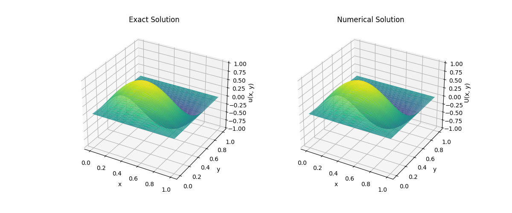

# Finite Element Solver for Poisson's Equation

## Overview
This project implements a **Finite Element Method (FEM) solver** for Poisson’s equation over a unit square domain. The numerical solution is computed using **triangular elements** and is compared against the exact analytical solution. The solver also features an interactive **3D visualization** using Plotly to illustrate both the numerical and exact solutions.

## Problem Statement
We solve the Poisson equation:

\[ -\Delta u = f(x, y), \quad \text{for } (x, y) \in \Omega \]

with Dirichlet boundary conditions:

\[ u(x, y) = 0, \quad \text{for } (x, y) \in \partial\Omega \]

where:
- \( \Omega = [0,1] \times [0,1] \) is the unit square.
- \( f(x, y) = 5\pi^2 \sin(\pi x) \sin(2 \pi y) \) is the source term.
- The exact solution is given by \( u_{exact}(x, y) = \sin(\pi x) \sin(2\pi y) \).

## Key Features
- **Finite Element Discretization:** Uses **linear triangular elements** for domain discretization.
- **Sparse Matrix Implementation:** Utilizes **SciPy sparse matrices** for efficient storage and computation.
- **Boundary Conditions Handling:** Imposes **homogeneous Dirichlet boundary conditions** effectively.
- **Error Analysis:** Computes the **L2 error norm** between the numerical and exact solutions.
- **3D Visualization:** Employs **Plotly** for interactive **side-by-side visualization** of numerical vs. exact solutions with mesh triangulation.
- **Containerized Development:** The project includes a `.devcontainer` setup for running the solver inside **GitHub Codespaces** or a local **VS Code Dev Container**.

## Installation
To run this solver, install the required dependencies:

```bash
pip install numpy scipy plotly
```

## How to Run the Solver
### Running Locally
Execute the following command in your terminal:

```bash
python solver.py
```

### Running in GitHub Codespaces
This project is fully **containerized** using a **.devcontainer** configuration, allowing it to run seamlessly in **GitHub Codespaces**. To use:

1. Open the repository in **GitHub Codespaces**.
2. The development container will automatically build.
3. Open a terminal in Codespaces and run:
   ```bash
   python solver.py
   ```

### Expected Output
- **L2 Error:** The script prints the L2 error norm, quantifying the accuracy of the numerical solution.
- **Interactive 3D Visualization:** The script launches a browser window displaying the **numerical** and **exact** solutions side-by-side with mesh edges.

## 3D Visualization
The visualization consists of:
- **Left Panel (Blue):** Numerical FEM solution.
- **Right Panel (Red, Offset):** Exact solution shifted right for comparison.
- **Black Wireframe:** Triangulated mesh structure overlaid for clarity.

## Example Visualization
A sample **3D visualization** (generated by Plotly) is shown below:



## File Structure
```
.
├── solver.py         # Main solver script
├── .devcontainer/    # Containerized development configuration
├── figures/          # Directory for storing figures
└── README.md         # This file
```

## Future Enhancements
- Implement **higher-order elements** for improved accuracy.
- Extend to **non-uniform meshes** for better domain adaptation.
- Parallelize computations using **Numba or multiprocessing**.

## License
This project is open-source and distributed under the **MIT License**.

