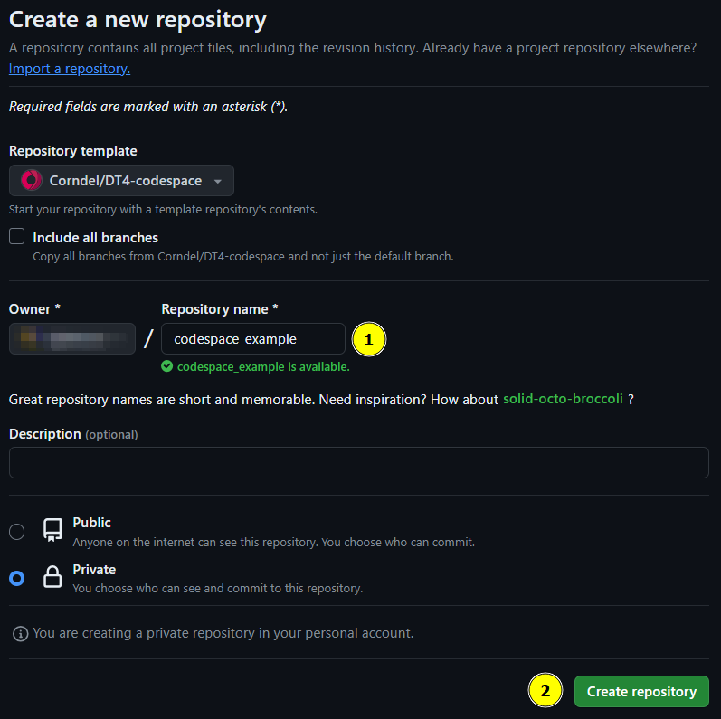
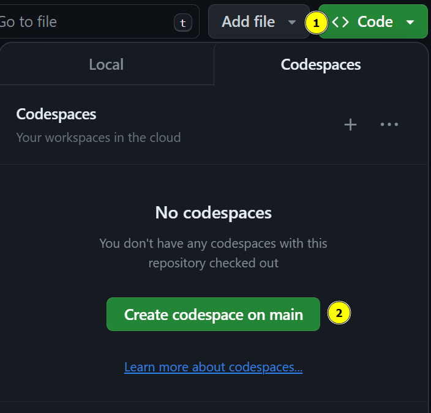
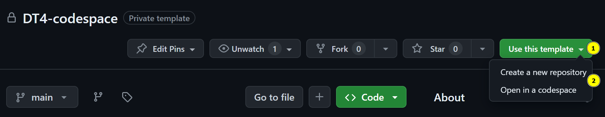
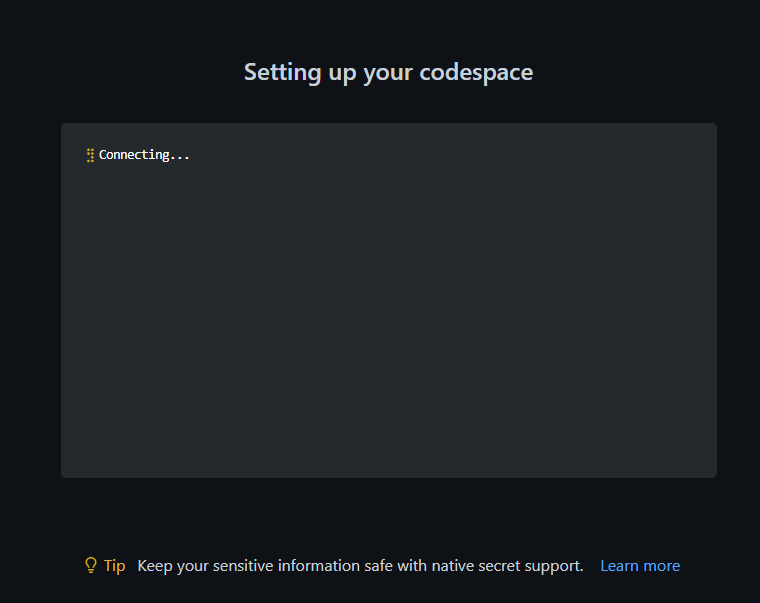
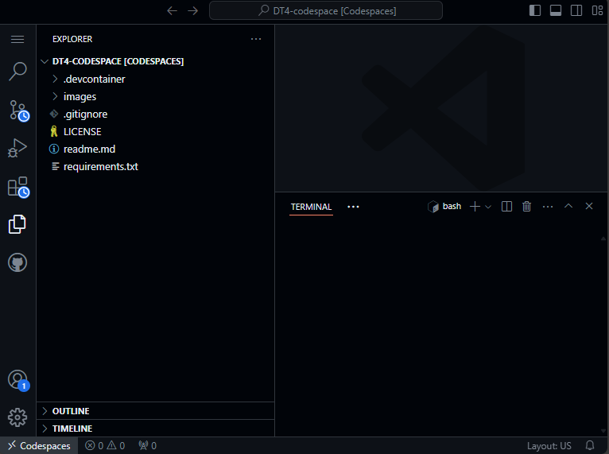
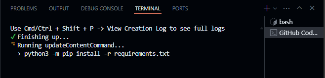
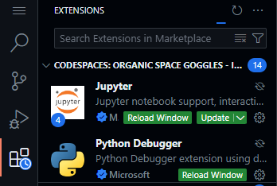
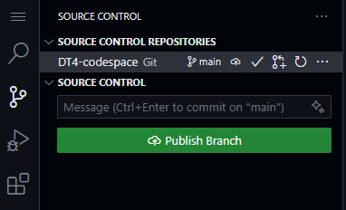

# DT4 codespace

This repository contains all you will need to launch a [GitHub Codespace](https://github.com/codespaces) with all the Python packages used in the first 4 modules of DTSP.

You can find the list of packages in the `requirements.txt` file.

>[!Note]
>This uses part of your monthly GitHub codespace minutes. For more information on how to see your remaining minutes, go to the [GitHub docs on codespaces billing](https://docs.github.com/en/billing/managing-billing-for-github-codespaces/viewing-your-github-codespaces-usage)

## How to use the codespace

1. Click on the green **Use this template** button
2. Click on **Open in a codespace**.
    

        
If you know you will want to save what you are doing to a repository, click to expand this section

    1. Click on **Create a new repository**
    2. In the new repository page:
        1. Give your repository a name
        2. Click on **Create repository**

    

    3. Wait for the repository to be created
    4. In the new repository
        1. Click on **Code**
        2. Click on **Codespaces**
        3. Click on **Create codespace on main**

    
    

3. Wait for the codespace to be created

4. Once the codespace is created, you will see the following screen, which will look familiar from your desktop VS Code

5. Wait a few minutes for everything to be set up. After a moment you will see the terminal at the bottom of the screen start to install the Python packages.

6. You will also see the Python extensions being installed

7. Once everything is installed, you can start working on your Python code.

8. To save your work, click on the **Source Control** icon on the left-hand side of the screen and click on **Publish Branch**.

